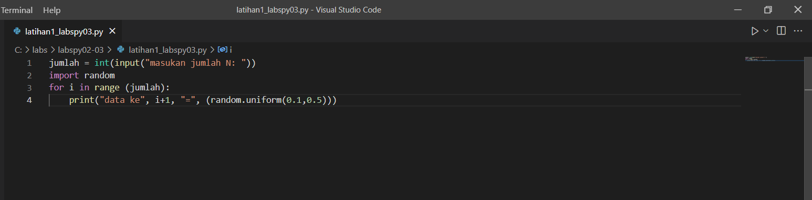
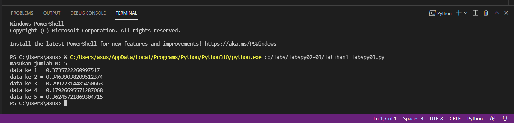
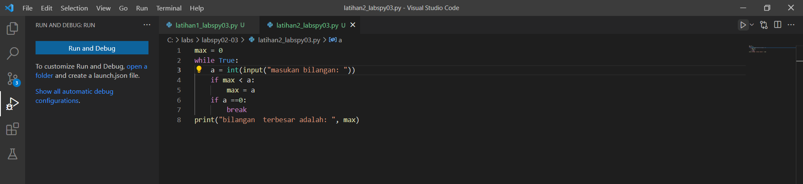
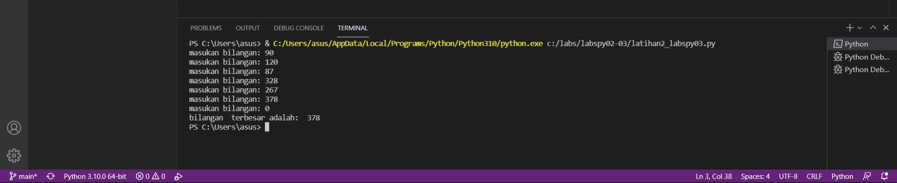
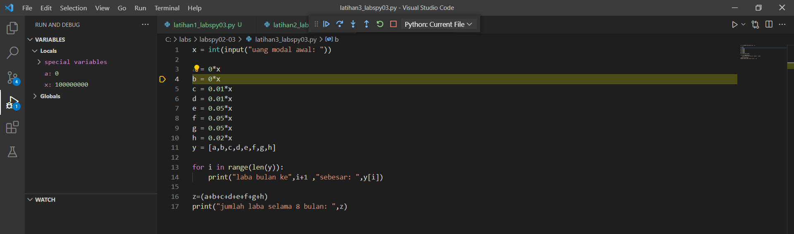
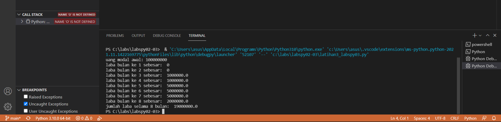

   # labspy02-03
## labspy02
### Menentukan sebuah bilangan terbesar dari 3 buah bilangan
## Flowchart
##### Berikut bentuk Flowchart untuk menentukan sebuah bilangan terbesar dari 3 buah bilangan

## Menggunakan statement if untuk mencari nilai terbesar dari 3 buah bilangan
##### bil1 adalah inisiasi bilangan pertama, bil2 bilangan kedua dan bil3 bilangan ketiga
##### Dengan cara statement if untuk bil1 sebagai bilangan pertama, elif untuk bil2 sebagai bilangan kedua dan else untuk bil3 bilangan ketiga, berikut gambar programnya

##### dan ini adalah hasil ketika program dijalankan, bilangan pertama yang terbesar

##### untuk bilangan kedua yang terbesar jika program dijalankan

##### sedangkan untuk bilangan ketiga yang terbesar jika program dijalankan

# labspy03
# latihan 1
### program untuk menampilkan N bilangan  acak yang lebih kecil dari 0.5
#### berikut bentuk programnya

### penjelasan program diatas
##### 1. jumlah = int(input("Masukkan jumlah N: ")) - adalah perintah untuk menginput nilai n tersebut
##### 2. import random - adalah perintah untuk mengimport built-in random yang telah tersedia di python
##### 3. for i in range(jumlah): - adalah perintah untuk i sebagai integer dalam baris jumlah
##### 4. print("data ke", i+1,"=",(random.uniform(0.1,0.5))) - adalah perintah untuk menampilkan hasil yang telah di input dengan ketentuan random uniform mulai dari nilai 0.1 sampai 0.5

#### berikut adalah hasil dari program diatas saat dijalankan

# latihan 2
## Buat program untuk menampilkan bilangan terbesar dari n buah data yang diinputkan
#### Berikut bentuk programnya

##### 1. max = 0 - adalah perintah untuk menampilkan nilai max yang adalah 0
##### 2. while True: - adalah perintah untuk pengulangan hingga waktu yang tidak ditentukan
##### 3. a = int(input("masukan bilangan: ")) - adalah perintah untuk menginput nilai integer
##### 4. if max < a: - adalah perintah untuk tipe data if atau jika, maksimal nilai lebih kecil dari a atau integer
##### 5. max = a - perintah untuk nilai maximal sama dengan a atau integer
##### 6. if a ==0: - perintah untuk tipe data if atau jika a sama dengan 0 maka
##### 7. break - perintah untuk mengakhiri pengulangan, jadi jika menginput nilai 0 maka pengulangan berakhir atau selesai
##### 8. print("bilangan terbesar adalah: ", max) - adalah perintah untuk menampilkan hasil bilangan yang terbesar dari angka-angka yang telah terinput

#### berikut adalah hasil dari program diatas saat dijalnkan

# latihan 3
## program untuk menghitung laba investasi
#### berikut bentuk programnya

##### x = int(input("uang modal awal: ")) - adalah untuk menginput nilai x sebagai modal awal
##### a = 0*x - a adalah bulan pertama, karena bulan pertama belum memiliki laba, jadi masih 0 dikali dengan x nilai uang modal awal
##### b = 0*x - b adalah bulan kedua, karena bulan kedua belum memiliki laba, jadi nilai x dari uang modal dikali dengan 0
##### c = 0.01*x - c adalah bulan ketiga, dan sudah memiliki laba 1%, jadi ditulis 0.01 bentuk sederhana dari 1% dikali dengan modal atau uang awal dengan nilai x
##### d = 0.01*x - d adalah bulan keempat, dan labanya 1%, jadi ditulis 0.01 dikalikan dengan nilai x yang adalah uang awal atau modal
##### e = 0.05*x - e adalah bulan kelima, dan laba pada bulan kelima sebesar 5%, maka ditulis 0.05 dikalikan dengan nilai x untuk nilai uang awal atau modal
##### f = 0.05*x - f adalah bulan keenam, dan laba pada bulan keenam sebesar 5%, maka ditulis 0.05 dikalikan dengan nilai x untuk nilai uang awal atau modal
##### g = 0.05*x - g adalah bulan ketujuh, dan laba pada bulan ketujuh sebesar 5%, maka ditulis 0.05 dikalikan dengan nilai x untuk nilai uang awal atau modal
##### h = 0.02*x - h adalah bulan kedelapan, dan laba pada bulan kedelapan sebesar 2%, maka ditulis 0.02 dikalikan dengan nilai x untuk nilai uang awal atau modal
##### y=[a,b,c,d,e,f,g,h] - adalah untuk menentukan syarat y yang berisi a,b,c,d,e,f,g,h
##### for i in range(len(y)): - merupakan buat iterasi data menggunakan isi data y, dengan menampilkan urutan laba perbulan sesuai range yg di tentukan dengan hasil ke urutan yang diinputkan berasal data y
##### print("laba bulan Ke",i+1 ,"sebesar: ",y[i]) - buat menampilkan hasil laba dari bulan ke 1 sampai terakhir
##### z=(a+b+c+d+e+f+g+h) - Z buat data yang berisi hasil penjumlahan laba dari bulan pertama sampai bulan ke delapan
##### print("jumlah laba Selama 8 Bulan: ",z) - menampilkan hasil dari jumlah laba

##### berikut adalah hasil dari program diatas saat dijalankan
