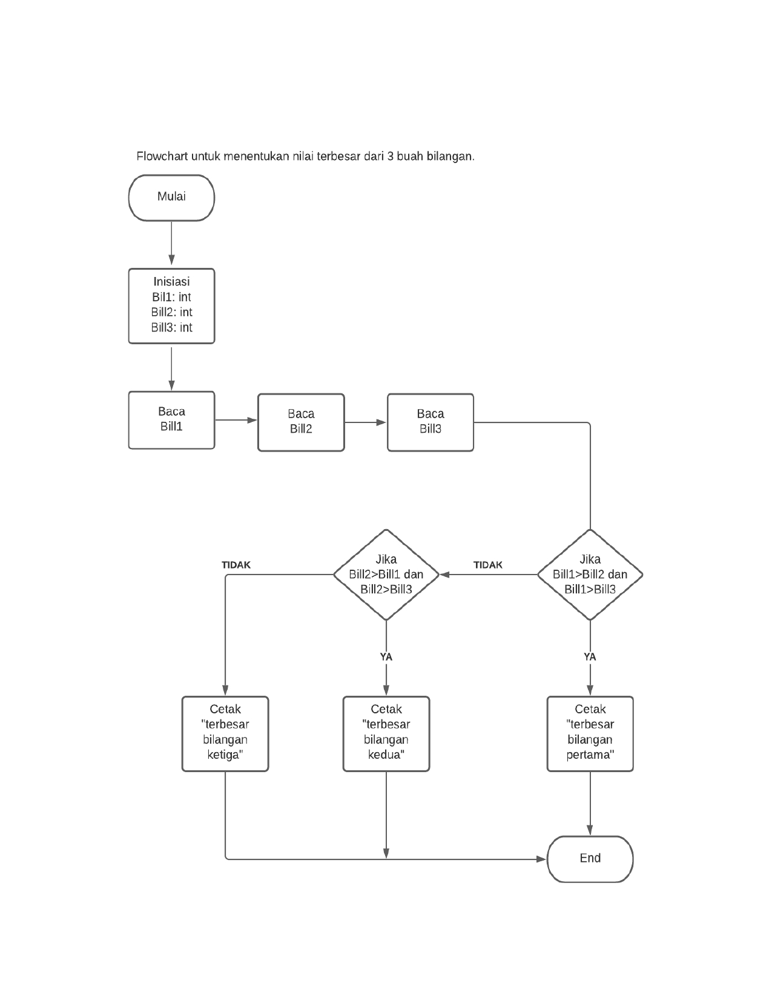

# labspy02-03
## labspy02
### Menentukan sebuah bilangan terbesar dari 3 buah bilangan
## Flowchart
##### Berikut bentuk Flowchart untuk menentukan sebuah bilangan terbesar dari 3 buah bilangan

## Menggunakan statement if untuk mencari nilai terbesar dari 3 buah bilangan
##### bil1 adalah inisiasi bilangan pertama, bil2 bilangan kedua dan bil3 bilangan ketiga
##### Dengan cara statement if untuk bil1 sebagai bilangan pertama, elif untuk bil2 sebagai bilangan kedua dan else untuk bil3 bilangan ketiga, berikut gambar programnya

##### dan ini adalah hasil ketika program dijalankan, bilangan pertama yang terbesar

##### untuk bilangan kedua yang terbesar jika program dijalankan

##### sedangkan untuk bilangan ketiga yang terbesar jika program dijalankan

